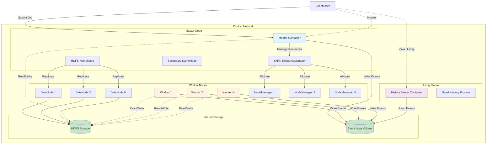

# 🏗️ Local Data Lake with HDFS and Spark

[](https://opensource.org/licenses/MIT)
[](https://www.docker.com/)
[](https://spark.apache.org/)
[](https://hadoop.apache.org/)
[](https://www.python.org/)

A production-ready local Data Lake implementation using Apache Hadoop HDFS and Apache Spark for distributed data processing and machine learning workloads.

## 📋 Table of Contents

- [Overview](#-overview)
- [Architecture](#-architecture)
- [Project Structure](#-project-structure)
- [Use Case](#-use-case)
- [Prerequisites](#-prerequisites)
- [Quick Start](#-quick-start)
- [Web Interfaces](#-web-interfaces)
- [Running the ML Job](#-running-the-ml-job)
- [Model Results](#-model-results)
- [HDFS Operations](#-hdfs-operations)
- [Cluster Management](#-cluster-management)
- [Troubleshooting](#-troubleshooting)
- [Contributing](#-contributing)
- [License](#-license)

## 🎯 Overview

This project demonstrates a complete Data Lake architecture running locally using Docker containers. It implements:

- **Distributed Storage**: HDFS (Hadoop Distributed File System) for reliable, scalable data storage
- **Distributed Processing**: Apache Spark with YARN resource manager for parallel data processing
- **Machine Learning Pipeline**: PySpark ML for training and evaluating classification models
- **Monitoring**: Spark History Server for job tracking and performance analysis

### Key Features

- 🐳 Fully containerized with Docker Compose
- 📊 Complete ML pipeline with cross-validation
- 🔄 Multi-node cluster (1 master + N workers)
- 📈 Real-time monitoring via web UIs
- 💾 Persistent data storage with HDFS
- 🚀 Production-ready configuration

## 🏛️ Architecture



### Components

| Component | Role | Port |
|-----------|------|------|
| **Master Node** | Coordinates cluster, runs NameNode & ResourceManager | 9870 (HDFS), 8088 (YARN) |
| **Worker Nodes** | Execute tasks, run DataNodes & NodeManagers | Dynamic |
| **History Server** | Tracks completed Spark jobs | 18080 |
| **HDFS** | Distributed file system for data storage | 9000 |
| **YARN** | Resource manager and job scheduler | 8088 |

## 📁 Project Structure

```
local-datalake-with-hdfs-and-spark/
│
├── 📄 docker-compose.yml          # Multi-container orchestration
├── 📄 Dockerfile                  # Spark + Hadoop image definition
├── 📄 entrypoint.sh              # Container initialization script
├── 📄 requirements.txt            # Python dependencies
├── 📄 .env                        # Environment variables (not tracked)
├── 📄 .gitignore                 # Git ignore rules
├── 📄 LICENSE                    # Project license
├── 📄 README.md                  # This file
│
├── 📂 data/                       # Local data & HDFS outputs
│   ├── dataset.csv               # Input: Census income dataset
│   ├── part-*.csv                # Output: Processed predictions
│   └── model/                    # Trained model artifacts
│       ├── bestModel/            # Best CV model
│       │   ├── data/
│       │   │   └── _SUCCESS
│       │   └── metadata/
│       │       ├── _SUCCESS
│       │       └── part-00000
│       ├── estimator/            # LogisticRegression config
│       │   └── metadata/
│       ├── evaluator/            # BinaryClassificationEvaluator config
│       │   └── metadata/
│       └── metadata/             # CrossValidator metadata
│           ├── _SUCCESS
│           └── part-00000        # Contains avgMetrics & best params
│
├── 📂 jobs/                       # PySpark application code
│   └── job.py                    # ML pipeline: preprocessing + training + evaluation
│
├── 📂 logs/                       # Container logs (generated at runtime)
│
├── 📂 ssh/                        # SSH configuration for Hadoop
│   └── ssh_config                # Passwordless SSH setup
│
└── 📂 yarn/                       # Hadoop & Spark configuration files
    ├── capacity-scheduler.xml    # YARN capacity scheduler config
    ├── core-site.xml             # Hadoop core settings (HDFS URI)
    ├── hdfs-site.xml             # HDFS replication & storage
    ├── mapred-site.xml           # MapReduce framework settings
    ├── spark-defaults.conf       # Spark default configuration
    └── yarn-site.xml             # YARN resource management
```

## 🎓 Use Case

### Problem Statement

Predict whether a person's annual income exceeds $50,000 based on census data (age, education, occupation, etc.).

### Dataset

**Source**: UCI Adult Census Income Dataset  
**Records**: ~32,561 individuals  
**Features**: 14 attributes (8 categorical, 6 numerical)  
**Target**: Binary classification (`>50K` or `<=50K`)

### ML Pipeline

```
┌─────────────────────────────────────────────────────────────────────┐
│                         Data Preprocessing                          │
├─────────────────────────────────────────────────────────────────────┤
│  1. Load CSV from HDFS                                              │
│  2. Handle missing values (fill "Unknown" for categoricals)         │
│  3. Drop remaining NAs                                              │
└─────────────────────────────────────────────────────────────────────┘
                                    ↓
┌─────────────────────────────────────────────────────────────────────┐
│                      Feature Engineering                            │
├─────────────────────────────────────────────────────────────────────┤
│  4. StringIndexer → Convert categorical strings to indices          │
│  5. OneHotEncoder → Encode categorical indices to vectors           │
│  6. VectorAssembler → Combine all features into single vector       │
│  7. StringIndexer → Convert target "income" to binary label         │
└─────────────────────────────────────────────────────────────────────┘
                                    ↓
┌─────────────────────────────────────────────────────────────────────┐
│                    Model Training & Tuning                          │
├─────────────────────────────────────────────────────────────────────┤
│  8. Split data → 70% train, 30% test (seed=42)                     │
│  9. LogisticRegression estimator                                    │
│ 10. ParamGrid → regParam [0.1, 0.01]                               │
│ 11. CrossValidator → 5-fold CV, AUC metric, 3 parallel tasks       │
└─────────────────────────────────────────────────────────────────────┘
                                    ↓
┌─────────────────────────────────────────────────────────────────────┐
│                    Model Evaluation & Export                        │
├─────────────────────────────────────────────────────────────────────┤
│ 12. Evaluate on test set → Compute AUC-ROC                         │
│ 13. Save best model to HDFS → hdfs:///opt/spark/data/model         │
│ 14. Save AUC metric to HDFS → hdfs:///opt/spark/data/auc           │
└─────────────────────────────────────────────────────────────────────┘
```

## ⚙️ Prerequisites

- **Docker**: 20.10+ ([Install Docker](https://docs.docker.com/get-docker/))
- **Docker Compose**: 1.29+ (included with Docker Desktop)
- **Hardware**: Minimum 8GB RAM, 20GB disk space
- **OS**: Linux, macOS, or Windows with WSL2

## 🚀 Quick Start

### 1. Clone the Repository

```bash
git clone https://github.com/JadesonBruno/local-datalake-with-hdfs-and-spark.git
cd local-datalake-with-hdfs-and-spark
```

### 2. Create Environment File

```bash
# Copy the example .env (if provided) or create manually
cat > .env << 'EOF'
SPARK_HOME=/opt/spark
HADOOP_HOME=/opt/hadoop
EOF
```

### 3. Start the Cluster

```bash
# Start with 3 worker nodes
docker-compose up -d --scale data-lake-worker=3
```

**Expected output:**
```
✅ Creating network "local-data-lake_default"
✅ Creating volume "local-data-lake_data-lake-logs"
✅ Creating master ... done
✅ Creating data-lake-worker_1 ... done
✅ Creating data-lake-worker_2 ... done
✅ Creating data-lake-worker_3 ... done
✅ Creating history-server ... done
```

### 4. Verify Cluster Health

```bash
# Check running containers
docker-compose ps

# Check HDFS status
docker exec master hdfs dfsadmin -report

# Check YARN nodes
docker exec master yarn node -list

# View logs
docker-compose logs -f master
```

## 🌐 Web Interfaces

Access these URLs in your browser:

| Service | URL | Description |
|---------|-----|-------------|
| **Spark Master UI** | [http://localhost:9091](http://localhost:9091) | Monitor active Spark jobs & workers |
| **HDFS NameNode UI** | [http://localhost:9871](http://localhost:9871) | Browse HDFS filesystem & health |
| **YARN ResourceManager** | [http://localhost:8081](http://localhost:8081) | Track YARN applications & resources |
| **Spark History Server** | [http://localhost:18081](http://localhost:18081) | View completed Spark job history |

## 🤖 Running the ML Job

### Submit the Training Job

```bash
docker exec master spark-submit \
  --master yarn \
  --deploy-mode cluster \
  ./apps/job.py
```

### Monitor Job Progress

1. **YARN UI**: Check application status at [http://localhost:8081](http://localhost:8081)
2. **Logs**: Follow real-time logs
   ```bash
   docker-compose logs -f master
   ```
3. **History Server**: After completion, view detailed metrics at [http://localhost:18081](http://localhost:18081)

### Job Execution Flow

```
Client (You)
     │
     ├─[1]─> Submit job to YARN
     │
     v
YARN ResourceManager (Master)
     │
     ├─[2]─> Allocate Application Master
     │
     v
Spark Driver (Worker Node)
     │
     ├─[3]─> Request executors from YARN
     │
     v
Spark Executors (Worker Nodes)
     │
     ├─[4]─> Read dataset.csv from HDFS
     ├─[5]─> Execute ML pipeline (transform, train, validate)
     ├─[6]─> Save model to HDFS
     └─[7]─> Save AUC metric to HDFS
```

## 📊 Model Results

### Performance Metrics

After running the job, check the model performance:

```bash
# View AUC metric
docker exec master hdfs dfs -cat /opt/spark/data/auc/part-*.csv
```

**Cross-Validation Results** (from metadata):
- **Best Model**: regParam = 0.01
- **Average Metrics**:
  - regParam=0.1 → AUC: **0.8951**
  - regParam=0.01 → AUC: **0.9037** ✅ (Best)

### Model Artifacts

```bash
# List saved model structure
docker exec master hdfs dfs -ls -R /opt/spark/data/model
```

**Output structure:**
```
/opt/spark/data/model/
├── bestModel/               # Winning model from cross-validation
│   ├── data/
│   └── metadata/
├── estimator/              # LogisticRegression configuration
│   └── metadata/
├── evaluator/              # BinaryClassificationEvaluator config
│   └── metadata/
└── metadata/               # CrossValidator params & metrics
    └── part-00000          # Contains avgMetrics: [0.8951, 0.9037]
```

### Interpretation

- **AUC = 0.9037**: Excellent discrimination between income classes
- **Model Choice**: Logistic Regression with L2 regularization (regParam=0.01)
- **5-Fold CV**: Robust validation prevents overfitting

## 💾 HDFS Operations

### Basic Commands

```bash
# List HDFS contents
docker exec master hdfs dfs -ls /opt/spark/data

# Create directory
docker exec master hdfs dfs -mkdir /opt/spark/data/test

# Copy file from local to HDFS
docker exec master hdfs dfs -put ./data/dataset.csv /opt/spark/data/

# Download file from HDFS to local
docker exec master hdfs dfs -get /opt/spark/data/model ./local_model

# View file content
docker exec master hdfs dfs -cat /opt/spark/data/auc/part-*.csv

# Check HDFS usage
docker exec master hdfs dfs -df -h

# Remove directory
docker exec master hdfs dfs -rm -r /opt/spark/data/test
```

### Data Flow Example

```bash
# 1. Upload new dataset
docker cp new_data.csv master:/opt/spark/data/
docker exec master hdfs dfs -put /opt/spark/data/new_data.csv /opt/spark/data/

# 2. Process with Spark
docker exec master spark-submit --master yarn --deploy-mode cluster ./apps/job.py

# 3. Retrieve results
docker exec master hdfs dfs -get /opt/spark/data/predictions ./results/
```

## 🛠️ Cluster Management

### Scale Workers

```bash
# Scale to 5 workers
docker-compose up -d --scale data-lake-worker=5

# Scale down to 1 worker
docker-compose up -d --scale data-lake-worker=1
```

### Restart Services

```bash
# Restart all containers
docker-compose restart

# Restart specific service
docker-compose restart master
```

### Stop Cluster

```bash
# Stop containers (preserve data)
docker-compose stop

# Stop and remove containers (preserve volumes)
docker-compose down

# Stop and remove everything (including data)
docker-compose down --volumes --remove-orphans
```

### Rebuild After Changes

```bash
# Rebuild images without cache
docker-compose build --no-cache

# Recreate containers with new image
docker-compose up -d --force-recreate
```

## 🐛 Troubleshooting

### Common Issues

#### 1. NameNode Not Starting

**Symptoms**: Master container exits or HDFS commands fail

**Solution**:
```bash
# Check if namenode needs formatting
docker exec master hdfs dfsadmin -report

# Force reformat (WARNING: deletes data)
docker exec master hdfs namenode -format -force
docker-compose restart master
```

#### 2. HDFS in Safe Mode

**Symptoms**: "Cannot create file... Name node is in safe mode"

**Solution**:
```bash
# Check safe mode status
docker exec master hdfs dfsadmin -safemode get

# Force exit safe mode (after verifying DataNodes are up)
docker exec master hdfs dfsadmin -safemode leave
```

#### 3. Workers Not Connecting

**Symptoms**: No DataNodes or NodeManagers visible in UIs

**Solution**:
```bash
# Check worker logs
docker-compose logs data-lake-worker

# Verify network connectivity
docker exec master ping data-lake-worker

# Restart workers
docker-compose restart data-lake-worker
```

#### 4. Port Conflicts

**Symptoms**: "Bind for 0.0.0.0:9091 failed: port is already allocated"

**Solution**:
```bash
# Find process using port
netstat -ano | findstr :9091   # Windows
lsof -i :9091                  # Linux/Mac

# Kill process or change port in docker-compose.yml
```

### Logs Analysis

```bash
# View all logs
docker-compose logs

# Follow specific service
docker-compose logs -f master

# Last 100 lines
docker-compose logs --tail=100 master

# Save logs to file
docker-compose logs > cluster_logs.txt
```

### Health Checks

```bash
# Check Java processes in master
docker exec master jps

# Expected output:
# NameNode
# SecondaryNameNode
# ResourceManager
# Jps

# Check Java processes in worker
docker exec data-lake-worker jps

# Expected output:
# DataNode
# NodeManager
# Jps
```

## 🤝 Contributing

Contributions are welcome! Please follow these steps:

1. Fork the repository
2. Create a feature branch (`git checkout -b feat/amazing-feature`)
3. Commit with semantic commits (`git commit -m '✨ feat: add amazing feature'`)
4. Push to branch (`git push origin feat/amazing-feature`)
5. Open a Pull Request

### Commit Convention

This project follows [Conventional Commits](https://www.conventionalcommits.org/):

- `🎉 init:` Initial commit
- `✨ feat:` New feature
- `🐛 fix:` Bug fix
- `📚 docs:` Documentation changes
- `🧱 ci:` CI/CD changes
- `♻️ refactor:` Code refactoring
- `⚡ perf:` Performance improvements
- `🧪 test:` Tests
- `🔧 chore:` Maintenance tasks

## 📜 License

This project is licensed under the MIT License - see the [LICENSE](LICENSE) file for details.

## 🙏 Acknowledgments

- [Apache Spark](https://spark.apache.org/) - Unified analytics engine
- [Apache Hadoop](https://hadoop.apache.org/) - Distributed storage and processing
- [Docker](https://www.docker.com/) - Containerization platform
- [UCI ML Repository](https://archive.ics.uci.edu/ml/) - Dataset source

## 📞 Support and Contact

**Jadeson Bruno**
- 📧 Email: jadesonbruno.a@outlook.com
- 🐙 GitHub: [@JadesonBruno](https://github.com/JadesonBruno)
- 💼 LinkedIn: [Jadeson Bruno](https://www.linkedin.com/in/jadeson-silva/)

---

⭐ **If this project was helpful, please give it a star on GitHub!**

📝 **License**: MIT - see the [LICENSE](LICENSE) file for details.

**Made with ❤️ by [Jadeson Bruno](https://github.com/JadesonBruno)**
